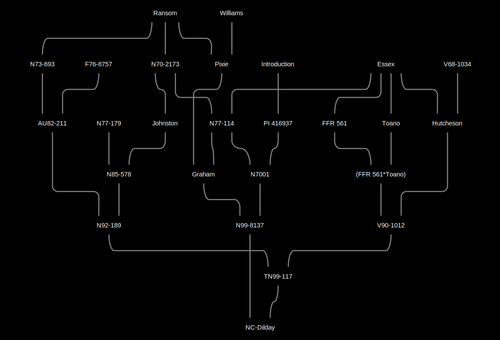
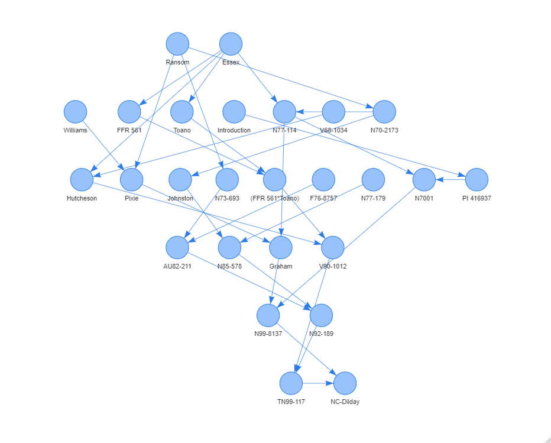

# Soybase Pedigree Visualization  
Visualization scripts for the Soybase soybean parentage data.

Cytoscape             |  visNetwork
:-------------------------:|:-------------------------:
  |  

## Overview  
The main script is **CytoscapePedigree.R**. This script uses the soybean parentage data in the **SoybasePedigreeData.csv** table to  make pedigree trees for a given soybean cultivar with Cytoscape. Because of this [Cytoscape](https://cytoscape.org/) has to be installed for the script to work. The **MakeFullGraph.R** script is used to make an igraph object using the full set of pedigree data. This graph is then used in the **GetPedigree_fromGraph** function to rapidly build a pedigree tree for some given cultivar. This function is a faster replacement for the less efficient **GetPedigree** function.

After that, the easiest way to use this script would probably be to clone this repository as a new project in RStudio and run it from there. I'd also recommend using the [yFiles Hierarchic layout](http://manual.cytoscape.org/en/stable/Navigation_and_Layout.html#yfiles-layouts) in cytoscape to visualize the pedigrees. The other layouts have tended to look pretty confusing. 

## Shiny App
I've made a small [shiny app](https://jhgb5.shinyapps.io/pedigreenetwork/) to show these pedigree networks.  

## Future work  
- ~~A shiny app that includes cytoscape would be nice so that everything can be done in the same place. The [cyjShiny](https://github.com/cytoscape/cyjShiny) package looks promising, but I'll have to mess around with it.~~   
- ~~Add functions to make more traditional text based pedigrees. While not as helpful for visualizing the pedigrees (IMO), could still be helpful to augment the plots with an alternate representation of the same information.~~ (made the **Pedigree_asString** function)
- Add tables with supplementary data for the cultivars. I'll need to track down phenotype data, but [haplotype data](https://soybase.org/snps/index.php#dltable) from soybase would also be a good place to start. Could be used to investigate patterns in phenotypic and genotypic similarity/differences. 
- Reformatting this repository as a R package would make use easier. 

